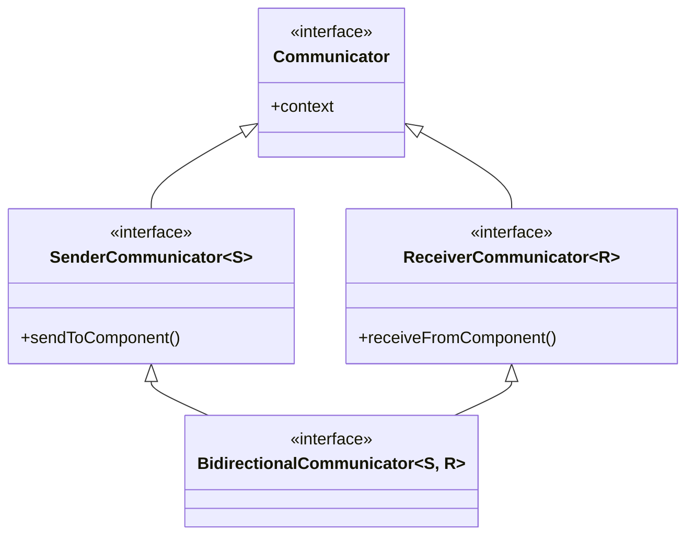

# Communication Architecture

```mermaid
classDiagram
  class Communicator {
    +context
  }
  <<interface>> Communicator

  class SenderCommunicator~S~ {
    +sendToComponent()
  }
  <<interface>> SenderCommunicator

  class ReceiverCommunicator~R~ {
    +receiveFromComponent()
  }
  <<interface>> ReceiverCommunicator

  class BidirectionalCommunicator~S, R~
  <<interface>> BidirectionalCommunicator

  Communicator <|-- SenderCommunicator
  Communicator <|-- ReceiverCommunicator
  SenderCommunicator <|-- BidirectionalCommunicator
  ReceiverCommunicator <|-- BidirectionalCommunicator
```

