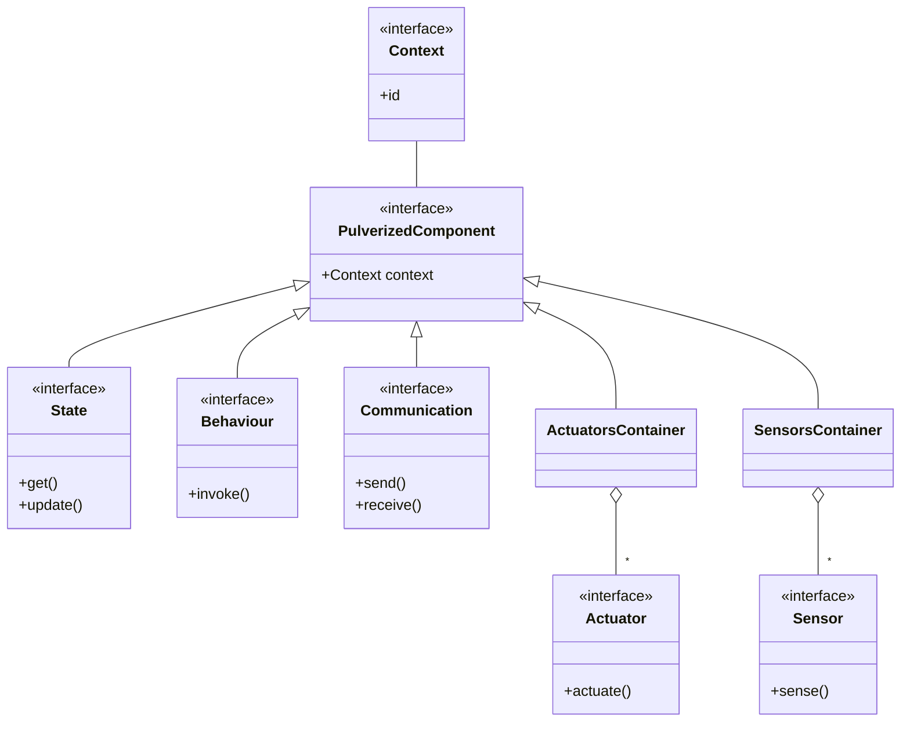

# Core Architecture

```mermaid
classDiagram
  class Context{
    +id
  }
  <<interface>> Context
  class PulverizedComponent {
    +Context context
  }
  <<interface>> PulverizedComponent
  class State{
    +get()
    +update()
  }
  <<interface>> State
  class Behaviour {
    +invoke()
  }
  <<interface>> Behaviour
  class Communication {
    +send()
    +receive()
  }
  <<interface>> Communication
  class SensorsContainer
  class ActuatorsContainer
  class Sensor {
    +sense()
  }
  <<interface>> Sensor
  class Actuator {
    +actuate()
  }
  <<interface>> Actuator

  Context -- PulverizedComponent
  PulverizedComponent <|-- Behaviour
  PulverizedComponent <|-- Communication
  PulverizedComponent <|-- State
  PulverizedComponent <|-- ActuatorsContainer
  PulverizedComponent <|-- SensorsContainer

  SensorsContainer o-- "*" Sensor
  ActuatorsContainer o-- "*" Actuator
```

