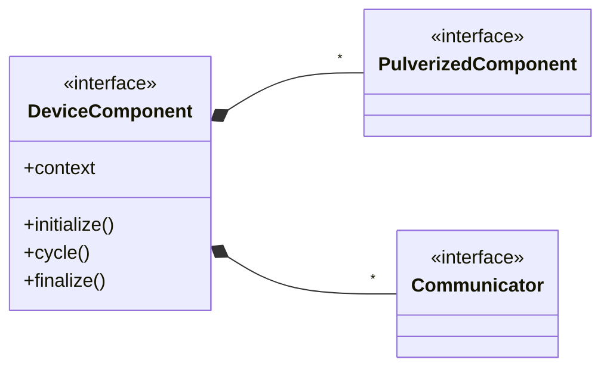

# Device Component Architecture

```mermaid
%%{init:{'flowchart':{'nodeSpacing': 80, 'rankSpacing': 130}}}%%
classDiagram
  direction LR
  class DeviceComponent {
    +context
    +initialize()
    +cycle()
    +finalize()
  }
  <<interface>> DeviceComponent

  class Communicator
  <<interface>> Communicator

  class PulverizedComponent
  <<interface>> PulverizedComponent

  DeviceComponent *-- "*" PulverizedComponent
  DeviceComponent *-- "*" Communicator
```

